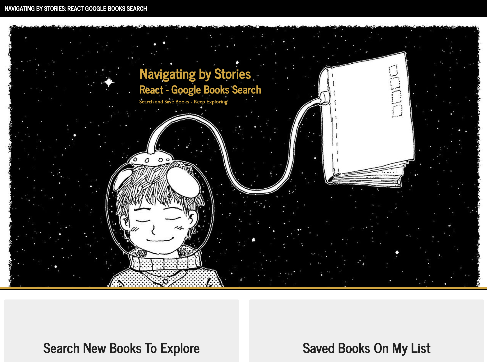

# React-Google-Books-Search


The goal was to create a new React-based Google Books Search app. On the frontend, this involved creating React components, working with helper/util functions, and utilizing React lifecycle methods to query and display books based on user searches. On the server side, it also involved using Node, Express and MongoDB so that users can save books to review or purchase later.

# Table of Contents
  * [User Story](#User-Story)
  * [Installation](#Installation)
  * [Deployed](#Deployed)
  * [Usage](#Usage)
  * [Contributing](#Contributing)
  * [License](#License)
  * [Tests](#License)
  * [Questions](#Questions)

## User Story
```
As a user, I WANT to be able to query and display searched books,
AND I WANT to be able to save books to review and purchase later.
```

## Installation
```
i. Fork the Github repository.
ii. Clone the forked repo into your local machine using gitbash/terminal to pull the project and data.
iii. Run the command-lines to run the app functionality. You can also access the files and assets via Visual Studio to view the code. 
iv. 1. npm install // 2. npm start
v. Explore the app.
```
## Deployed
Deployed application in Heroku: [Live App](https://navigating-by-stories.herokuapp.com/)

* Below is screenshot of the application:


## Usage
```
Technologies Used:
MERN - MongoDB - Express - React - Node - axios - ReactDOM.render - components - state - props - classes - hooks - socket.io
```
An employee or manager would benefit greatly from being able to view non-sensitive data about other employees. It would be particularly helpful to be able to filter employees by name.

Given a table of random users, when the user loads the page, a table of employees should render. 

The user should be able to:
  * Sort the table by at least one category
  * Filter the users by at least one property.

## Contributing
Pull requests are welcome. Please use the [Contributor Covenant Code of Conduct](https://www.contributor-covenant.org/version/2/0/code_of_conduct/code_of_conduct.md) and for major changes, please open an issue beforehand to discuss the changes.

## License 
[MIT](https://github.com/carmenobied/React-Google-Books-Search/blob/master/LICENSE) | Copyright © 2020 Carmen Obied

## Tests 
There are currently no tests for this project.

## Questions  
Have questions? Contact me at:
##### Email: carmen.obied@gmail.com
##### Github:  **carmenobied** [carmenobied](https://github.com/carmenobied)
